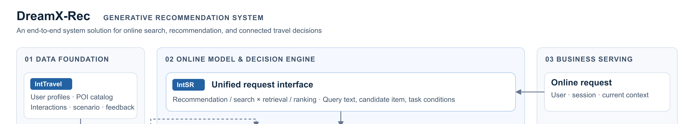
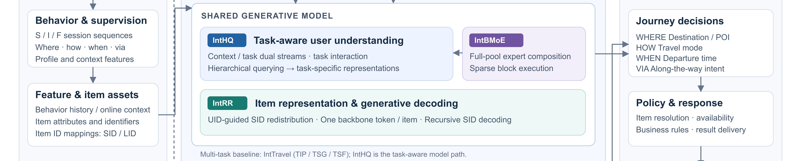
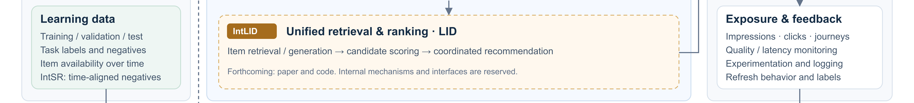
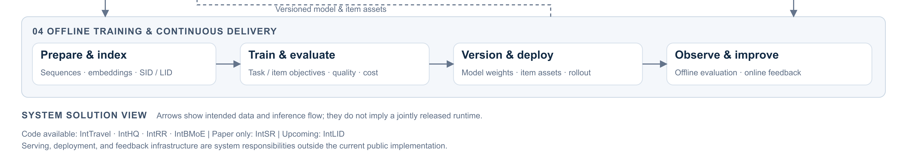
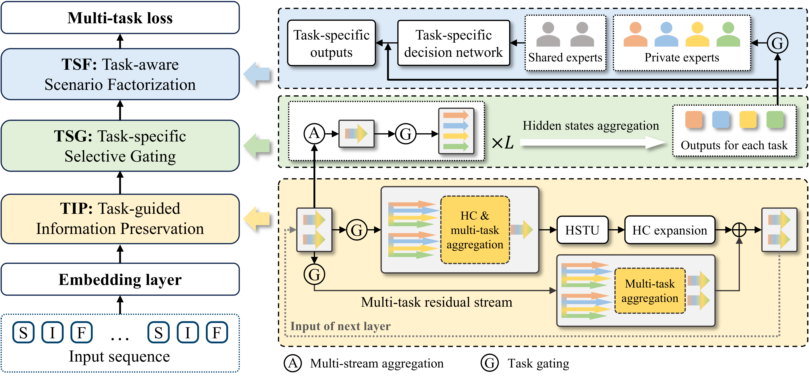
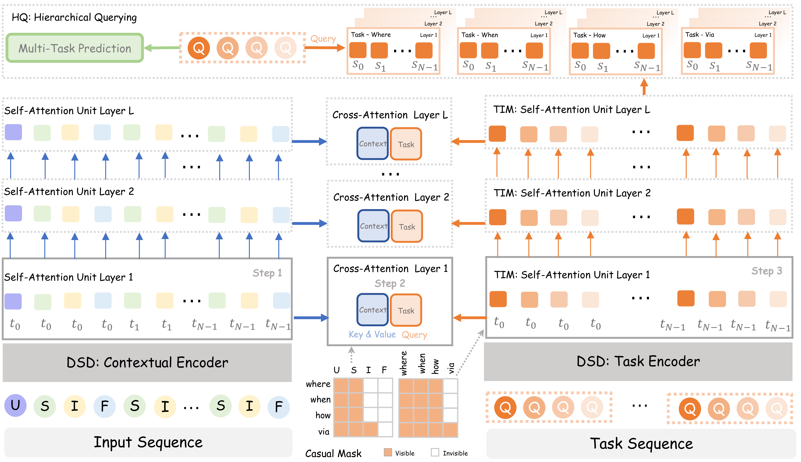
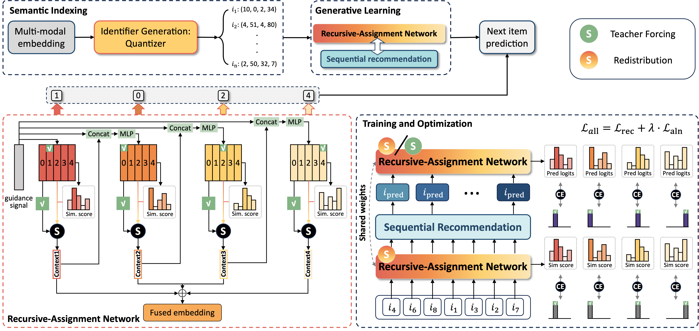
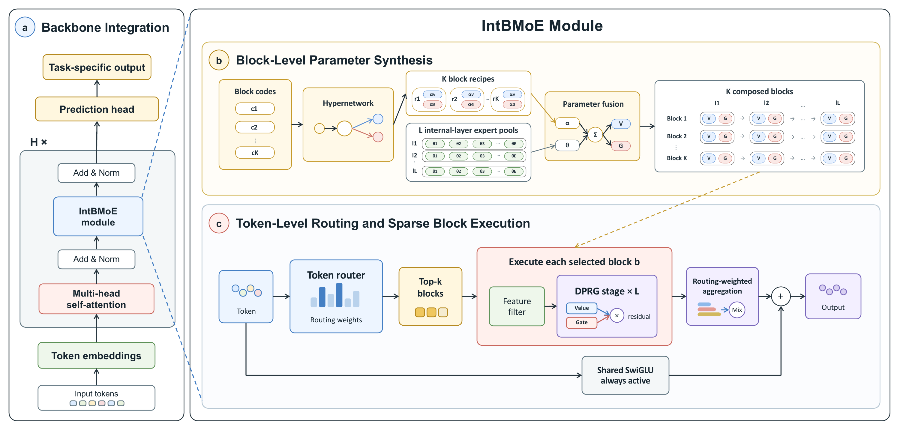

# DreamX-Rec: Toward a Unified Generative Recommendation System

DreamX-Rec brings together **six complementary research works** toward a unified generative recommendation system. Its goal is to connect a user's interaction history and current context with item retrieval, candidate scoring, and the decisions that shape a journey: **where to go, how to travel, when to depart, and what to visit along the way**.

The six works address successive responsibilities within this system: **IntTravel** provides the data and multi-task foundation; **IntSR** unifies search and recommendation through explicit request conditions; **IntHQ** models user behavior and task interactions; **IntRR** aligns item representations with generative decoding; **IntBMoE** expands model capacity through efficient expert computation; and **IntLID** addresses unified retrieval and ranking. Together, they define a complete generative recommendation system solution for real-world online applications, covering behavioral data, user understanding, item generation, efficient computation, and unified retrieval and ranking.

**Current release:** the repository includes IntTravel preprocessing and multi-task examples, the IntHQ multi-task model, the IntRR semantic indexing and generative recommendation pipeline, and IntBMoE with recommendation, language, and vision examples. IntSR has not yet been open-sourced; IntLID's paper and code are forthcoming. The system overview below connects the five available papers and IntLID's announced scope into a common architecture. A jointly integrated training and serving pipeline is not yet included.

## System overview

| System responsibility | Work | Main contribution | Available resources |
| :--- | :--- | :--- | :--- |
| Data and multi-task foundation | [IntTravel](https://arxiv.org/abs/2602.11664) | Large-scale travel data, S/I/F sequences, four connected tasks, and a multi-task generative baseline | [Paper](https://arxiv.org/abs/2602.11664), [Data processing](data_process/), [model](inttravel/model.py), [training](inttravel/train.py) |
| Unified search and recommendation interface | [IntSR](https://arxiv.org/abs/2509.21179) | Query-conditioned search and recommendation, efficient query processing, and temporally aligned negatives | [Paper](https://arxiv.org/abs/2509.21179) |
| Task-aware user understanding | [IntHQ](https://arxiv.org/abs/2608.09634) | Separate context/task streams, explicit task interaction, and adaptive querying across layers | [Paper](https://arxiv.org/abs/2608.09634), [Data processing](data_process/), [model](inthq/model.py), [training](inthq/train.py) |
| Semantic item representation and decoding | [IntRR](https://arxiv.org/abs/2602.20704) | UID-guided SID redistribution and recursive decoding with one backbone token per item | [Paper](https://arxiv.org/abs/2602.20704), [SID generation, model and training](intrr/) |
| Efficient model capacity | [IntBMoE](https://arxiv.org/abs/2609.21346) | Full expert-pool participation through reusable composed blocks with sparse execution | [Paper](https://arxiv.org/abs/2609.21346), [Data processing](data_process/), [model](intbmoe/recommendation/model.py), [training](intbmoe/recommendation/train.py) |
| Unified retrieval and ranking | [IntLID (upcoming)](#intlid-unified-retrieval-and-ranking-upcoming) | Reserved for the forthcoming work on retrieval-ranking integration | Paper and code not yet released |

IntTravel, IntHQ, and the IntBMoE recommendation example share the same [data preprocessing pipeline](data_process/), with separate model and training implementations. IntBMoE also includes [language and vision examples](intbmoe/README.md) with their own data pipelines.

<!-- Continuous image bands avoid the repository viewer's 500px image-height cap.
     Keep width/height/style attributes unset; regenerate with docs/scripts/render-architecture.cjs. -->
<a href="docs/assets/dreamx-rec-architecture.png"><br><br><br></a>

[View full-resolution PNG](docs/assets/dreamx-rec-architecture.png) · [Download vector source (SVG)](docs/assets/dreamx-rec-architecture.svg)

The architecture connects **data foundation, online modeling and decisions, business serving, and offline training** into a complete system solution. IntTravel supplies the behavioral foundation; IntSR defines request semantics; IntHQ models user context and task interactions; IntRR connects item representations to generative decoding; IntBMoE provides efficient model capacity; and IntLID covers unified retrieval and ranking. The shared item-asset layer accommodates both SID and LID representations, with SID-based representation and decoding in IntRR and the LID role reserved for IntLID. Offline training publishes versioned model and item assets to online inference, while exposure and feedback support subsequent learning and evaluation.

This is a system architecture across the six works, rather than a diagram of a single released runtime. The dashed deployment path represents model and asset delivery; the dashed IntBMoE connection denotes a capacity integration point, and the amber dashed module reserves IntLID's forthcoming contribution. The standalone implementations have different data and training interfaces; their joint integration, serving infrastructure, and feedback collection remain outside the current public release. [Open the vector diagram](docs/assets/dreamx-rec-architecture.svg) for a scalable view.

### How the components fit together

1. **Build a common view of behavior.** IntTravel supplies user profiles, item attributes, contextual interactions, and supervision for four travel decisions. Its chronological `S -> I -> F` representation separates the context available before a decision from the chosen item and subsequent feedback.
2. **Express what the request asks for.** IntSR adds a query interface: recommendation retrieval uses a shared query token, search adds user text, and ranking conditions on a candidate item. These request modes and IntTravel's four business tasks are different axes; a complete service can combine them where appropriate.
3. **Learn shared context and specialized task representations.** IntTravel provides a baseline through information preservation, selection, and scenario factorization. IntHQ advances this part of the system with task-specific computation throughout the encoder, task interaction, and adaptive layer selection. They are alternative multi-task model paths, rather than consecutive serving stages.
4. **Choose an item representation and output space.** The IntTravel/IntHQ examples use POI ID/attribute embeddings and candidate scoring. The standalone IntRR implementation provides a complementary SID-based path: refine semantic item representations using collaborative signals, then decode item identifiers through a lightweight recursive network. Integrating this path into the travel models would affect both the item encoder and the POI output objective.
5. **Scale capacity within the compute budget.** IntBMoE changes the transformations inside a model: compose a bounded set of blocks from a full expert pool, then execute only selected blocks per token. This addresses a different cost from IntRR's sequence-length reduction, and can be evaluated as a capacity extension to the task-aware model.
6. **Unify retrieval and ranking.** IntLID addresses retrieval-ranking integration as a dedicated system responsibility. IntSR provides the query-conditioned formulation for search and recommendation, including retrieval and ranking request modes; IntLID's method and precise relationship to that formulation will be documented with its release.
7. **Close the learning loop.** A deployed service must resolve valid items, apply availability constraints, return results, and log exposure and feedback for subsequent training. IntSR's time-aligned negative sampling makes item availability relevant during training as well as serving.

This decomposition gives the repository a coherent progression: **unify the data and request semantics, improve task-aware understanding, align item representations with recommendation objectives, scale computation efficiently, and unify retrieval and ranking**. These six works define the research scope of DreamX-Rec. Results from the available papers do not establish the quality or latency of a combined system, and IntLID results will be documented when released.

## Data and prediction contract

### IntTravel dataset

The IntTravel paper describes approximately **4.1 billion interactions, 163 million users, and 7.3 million POIs**. These figures describe the full dataset, not the bundled sample. See the [dataset on Hugging Face](https://huggingface.co/datasets/GD-ML/IntTravel_dataset/tree/main).

The included [sample data](data_process/raw_data/) contains 100 user profiles and 2,518 interaction rows. The preprocessing example consumes four tables:

| File | Contents |
| :--- | :--- |
| `user_action.csv` | User ID, timestamp, action type, POI ID, user geographic/administrative region, weather, travel mode, and via POI ID |
| `user_profile.csv` | User ID and six anonymized profile features |
| `poi_info.csv` | POI ID, normalized popularity score, geographic ID, category ID, and administrative region ID |
| `poi_info_groupby_geographic.csv` | POIs grouped by geographic ID for geographically constrained negative sampling |

The paper describes anonymized identifiers and transformed coordinates. Geographic IDs preserve a neighborhood grouping; transformed coordinates should not be interpreted as original physical locations or exact distances.

### Shared context and four tasks

| Token | Meaning | Information carried |
| :--- | :--- | :--- |
| **S** | Scenario | Location, time, weather, and other pre-decision context |
| **I** | Item / intention | The interacted POI and its attributes |
| **F** | Feedback | Observed behavior and travel feedback |
| **U** | User profile | Six profile features providing global user context |

Each example supports up to **40 three-token sessions plus 6 profile tokens**, giving 126 context positions. The serialized feature arrays are newest-first `[F, I, S]`; the IntTravel/IntHQ loader reorders each session to `[S, I, F]` and packs **valid action tokens, six profile tokens, then trailing padding**. Profile positions are tracked explicitly, and causal indices control visibility. The IntBMoE recommendation loader retains the `[F, I, S]` layout. Chronological visibility is determined by the model's mask, not by assuming that array order is chronological.

| Task | Product question | Supervision in the public example | Prediction space |
| :--- | :--- | :--- | :--- |
| `where` | Where should the user go? | Current-session target POI at S | Positive POI and sampled negatives |
| `how` | How should the user travel? | Travel-mode label at S | 6 classes |
| `when` | When will the user depart? | Departure-time bucket at S | 49 classes |
| `via` | What POI is relevant after a destination is known? | Next-session POI label at I | Positive POI and sampled negatives |

The paper motivates `via` as on-the-way intent. In the released preprocessing, its concrete learning target is the **next session's POI**, as implemented in [FeaturePostProcessor](data_process/post_process_features.py). This distinction matters when constructing a waypoint-serving application.

`where`, `how`, and `when` predict before the current I/F contents are visible; `via` can use the current destination on I. POI tasks use up to 64 negative slots: 14 random and 50 geographic negatives. Random negatives are sampled from actual IDs in the loaded POI catalog. Sampling excludes the current and via POIs and removes duplicates across the two negative pools; smaller candidate pools yield fewer valid negatives. Preprocessing uses `--seed` (default `0`) for reproducible sampling and a separate random stream for the per-user `rand_1` split value, which is preserved in the processed CSV. Small label spaces use all classes. See [the preprocessing guide](data_process/readme.md), [feature configuration](data_process/feature_config.py), and [the shared loader](inthq/data.py).

### Extending the contract to search and semantic IDs

IntSR uses **S/Q/I/F**, where Q specifies the prediction condition. Its query placeholder is distinct from an IntHQ task token: the former expresses a request modality or candidate; the latter identifies a business task and maintains its own representation through the model.

| IntSR request mode | Query condition | Prediction |
| :--- | :--- | :--- |
| Recommendation retrieval | Shared query token | Item |
| Search retrieval | User's search text | Item |
| Recommendation ranking | Candidate item | Feedback/action for that candidate |
| Search ranking | Search text and candidate item | Feedback/action for that candidate |

IntRR's **SID** is a hierarchical semantic item identifier. Its **UID** is an item's unique ID, not a user ID. The released IntRR pipeline constructs SIDs separately from the hash embedding tables used by the travel models. It consumes item sequences, item embeddings, and item-to-SID mappings from its own Amazon data workflow. Adapting it to IntTravel requires building POI semantic inputs and mappings, preserving resolution back to actual POIs, and connecting the RAN losses and decoder to the travel tasks. One token per item does not mean one token per entire S/I/F session.

## Six research components

### IntTravel: data foundation and multi-task baseline

[Paper](https://arxiv.org/abs/2602.11664) · [Code](inttravel/) · [Data](https://huggingface.co/datasets/GD-ML/IntTravel_dataset/tree/main)

IntTravel turns connected travel decisions into a shared sequence-learning problem. Its multi-task framework preserves useful information through the backbone, selects relevant layers for each task, and specializes the output transformation:

- **Task-Guided Information Persistence (TIP):** task-guided HyperConnections preserve information through HSTU-style causal computation.
- **Task-Specific Selective Gating (TSG):** task-conditioned gates select information from different encoder layers.
- **Task-Aware Scenario Factorization (TSF):** shared and task-private expert parameters form a task/profile-conditioned prediction head.

The implementation maps these ideas to `MultiTaskHyperConnectionBlock`, `TaskSpecificGate`, and the shared `DSFNet` head. The public model uses the common embeddings, labels, losses, and optimizer utilities under `inthq/`; this is code reuse, not a requirement to run IntHQ first.



### IntSR: unify search, recommendation, retrieval, and ranking

[Paper](https://arxiv.org/abs/2509.21179)

IntSR provides the request-level framework. It conditions item generation or feedback prediction on different query modalities while sharing behavioral history. Its **Query-Driven Block (QDB)** processes query positions separately from historical context to reduce repeated computation. Customized session and query masks control which information is available at prediction time, while DSFNet supports scenario-specific transformations.

A second contribution is **time-varying candidate alignment**: negatives must have existed at the timestamp of the training interaction. This prevents learning against items that were not yet available or had already been removed and relies on timestamped item-lifecycle information.

System role: bring explicit search intent and implicit recommendation intent into a common learning and serving interface. QDB and IntHQ's dual streams both separate prediction-related computation from context, but their query semantics and masks differ; merging them requires an explicit design.

### IntHQ: task-aware understanding throughout the model

[Paper](https://arxiv.org/abs/2608.09634) · [Code](inthq/)

IntHQ addresses three weaknesses of extracting every task from a single shared representation: loss of task-specific information, insufficient modeling of task relations, and a fixed choice of representation depth.

- **Dual-Stream Decoupling (DSD):** separate context and task streams, with distinct attention parameters and task-to-context cross-attention.
- **Task-Interactive Modeling (TIM):** task self-attention learns interactions subject to causal visibility.
- **Hierarchical Querying (HQ):** task-identity queries aggregate the task-stream states collected across layers, adapting the selected depth to the input and task.

In [the implementation](inthq/model.py), `DualStreamLayer` performs context self-attention, task-context attention, and task self-attention; `HierarchicalQuery` aggregates task states across depth; `DSFNet` produces the task-specific output vectors. The released configuration uses a 16-layer encoder and four task slots per session. The paper's offline comparison uses a different depth setting, so the default demo is not an exact reproduction of every paper table.



### IntRR: align semantic items and reduce sequence length

[Paper](https://arxiv.org/abs/2602.20704) · [Code and usage](intrr/README.md)

IntRR addresses the mismatch between fixed semantic indexing and the recommendation objective. Its **Recursive-Assignment Network (RAN)** has two connected roles:

- **Item side:** an item UID embedding guides soft assignments across hierarchical semantic codebooks. The resulting level-wise representations are fused into one item embedding, with the original SID providing an alignment target.
- **User side:** the backbone's user state guides the same RAN to predict the next item's SID. Training uses teacher forcing along the target SID path; inference moves hierarchical decoding into RAN after a single backbone pass.

The backbone therefore processes one representation per item instead of flattening every SID level into its own history token. The objective combines recommendation loss and semantic alignment loss. This is an item-representation and decoding mechanism, not a reranking stage. Its reported experiments use Amazon Beauty, Sports, and Toys; integrating it with the four IntTravel tasks remains a separate validation step.

The released pipeline builds on GRID and separates semantic indexing from recommendation learning. [gen_sid.sh](intrr/gen_sid.sh) generates item embeddings, trains RK-Means/RQ-VAE/RVQ indexing models, and exports SIDs. [IntRRDecoderOnly](intrr/src/models/modules/semantic_id/intrr_decoder_only_model.py) implements item-side assignment, SID reconstruction loss, next-item prediction, and hierarchical beam search after one backbone pass. Its item-side code selection uses hard assignments in the forward pass with soft gradients through a straight-through estimator, then sums level representations into one item vector.

[run_intrr.sh](intrr/run_intrr.sh) launches the Hydra/Lightning experiment with separate training, validation, and testing data; [run_tiger.sh](intrr/run_tiger.sh) supplies a comparison baseline. The default IntRR experiment configures a T5-based model and SID Recall/NDCG evaluation. This is an independent next-item recommendation implementation; its data loader and training interface are separate from the four-task travel examples.



### IntBMoE: efficient model capacity

**IntBMoE: Integrating Block-Level Conditioning into Expert Composition for Full-Participation Mixture-of-Experts**

[Paper](https://arxiv.org/abs/2609.21346) · [Code and usage](intbmoe/README.md)

IntBMoE separates three quantities: **participation** (which expert bases contribute), **execution** (which transformations run for a token), and **materialization** (how many composed parameter sets are built).

A learned block codebook and shared hypernetwork compose a bounded set of reusable blocks from the full expert pool. Each token is routed to only its Top-k blocks. **Dual-Path Residual Gating (DPRG)** combines separately composed value and gate paths; feature filtering and an always-active shared expert complete the transformation.

The domain-independent implementation is [BlockMoE](intbmoe/core/block_moe.py). The recommendation example uses it in the sequence model and recommendation head, but trains **single-task POI prediction**, not IntHQ's four-task objective. Language modeling and image classification demonstrate reuse of the same component across domains; they are not stages of the recommendation pipeline.

The paper also studies precomposing and caching blocks for inference. The current `BlockMoE.forward` composes parameters on each call; a persistent serving cache is not implemented here. Connecting BlockMoE to IntHQ would require changes to the model and configuration, followed by quality and latency evaluation.



### IntLID: unified retrieval and ranking (upcoming)

**Status: paper and code not yet released.**

IntLID is the forthcoming work on **unified retrieval and ranking (召排一体化)** in the DreamX-Rec system. Within the six-work system, it covers the integration of item retrieval and candidate ranking. IntSR supplies the broader search/recommendation request formulation, while this section reserves the dedicated retrieval-ranking contribution for IntLID. Specific architectural connections remain to be documented. The method, architecture, evaluation results, paper link, code entry point, and citation will be added when released.

## Public code map

```text
.
├── data_process/                 # Raw sample -> sequences -> feature arrays
│   ├── raw_data/                 # Four anonymized sample tables
│   ├── data_processor.py         # Session construction and negative sampling
│   └── post_process_features.py  # S/I/F features and task labels
├── inttravel/                    # HyperConnection + selective gates + DSFNet
│   ├── config.py                 # Model and training configuration
│   ├── data.py                   # Re-exports the shared inthq.data adapter
│   ├── model.py                  # IntTravel encoder, selective gates and task heads
│   ├── train.py                  # Training entry point using inthq.runtime
│   └── run.sh                    # Single-process / RecIS DDP launcher
├── inthq/                        # Dual streams + task interaction + HQ + DSFNet
│   ├── config.py                 # Model and training configuration
│   ├── data.py                   # Shared IntTravel/IntHQ dataset adapter
│   ├── model.py                  # Model, embeddings, heads, losses and metrics
│   ├── runtime.py                # Shared training, last1 evaluation, DDP and checkpoints
│   ├── optim.py                  # Dense/sparse optimizer utilities
│   ├── train.py                  # IntHQ training entry point
│   └── run.sh                    # Single-process / RecIS DDP launcher
├── intrr/                       # Standalone SID-based next-item recommendation
│   ├── gen_sid.sh               # Item embeddings -> indexing model -> SIDs
│   ├── run_intrr.sh             # IntRR training and evaluation
│   ├── run_tiger.sh             # TIGER comparison baseline
│   ├── configs/                # Dataset paths and Hydra experiments
│   └── src/                    # RAN, models, data loading and SID metrics
├── intbmoe/
│   ├── core/block_moe.py          # Reusable expert-composition module
│   ├── recommendation/           # Single-task POI example
│   ├── nlp/                      # MiniPile language modeling
│   └── cv/                       # ImageNet-1K classification
└── docs/assets/                  # Framework illustrations
```

IntTravel and IntHQ have separate model configurations and training entry points. They share the dataset adapter, runtime, optimizer utilities, and common model components under `inthq/`. Other implementations expose their own model and training interfaces. There is no common switch that combines all six works in one model.

## Getting started

The commands below cover IntTravel, IntHQ, IntRR, and IntBMoE. Start from the repository root: shared feature preparation runs there, and each model workflow begins by entering its directory. IntTravel and IntHQ use compatible PyTorch environments; IntRR and IntBMoE require separate environments.

### Prepare shared travel features

IntTravel, IntHQ, and the IntBMoE recommendation example read the same processed feature format. A [processed sample](data_process/output/processed_features.csv) is included, so the bundled examples can run without regenerating it. For new raw data or to regenerate the sample with the current sampling policy:

```bash
python3 data_process/data_processor.py \
  --input-dir data_process/raw_data \
  --output-dir data_process/output \
  --skip-column-check --seed 0

python3 data_process/post_process_features.py \
  --input-file data_process/output/multi_task_input_seq_all.csv \
  --output-file data_process/output/processed_features.csv
```

`--skip-column-check` follows the bundled sample-loading path; check other tables against the schema above. Keep the generated `rand_1` column for user-level splitting on large datasets. Regenerate older exports if you need the revised catalog-based negative sampling and split metadata.

### Run the IntTravel sample

IntTravel loads `data_process/output/processed_features.csv` directly. Use `--data-path /path/to/processed_features.csv` for another compatible export; the previous `--raw-dir` and training-side `--max-actions` options are no longer supported. The loader checks required columns, array lengths, and the serialized token layout.

```bash
cd inttravel
pip install -r requirements.txt
bash run.sh
```

### Run the IntHQ sample

IntHQ uses the same feature format and command-line options as IntTravel:

```bash
cd inthq
pip install -r requirements.txt
bash run.sh
```

The default CLI uses reduced ID spaces and expert counts with the pure-PyTorch backend. `--full-config` enables the larger model configuration and requires substantially more resources. `--batch-size` is per device. Torch supports a single process on CPU or one GPU; RecIS requires a separate installation and CUDA, and supports multi-GPU DDP through the launchers:

```bash
# From the repository root
cd inttravel
NPROC=2 bash run.sh --embedding-backend recis --output-dir output/inttravel-recis-2gpu
```

```bash
# From the repository root
cd inthq
NPROC=2 bash run.sh --embedding-backend recis --output-dir output/inthq-recis-2gpu
```

`NPROC` defaults to `1` for these two launchers; values greater than one require the RecIS backend. See [IntTravel usage](inttravel/README.md) and [IntHQ usage](inthq/README.md) for backend details.

Checkpoints are saved after each epoch: Torch uses `<output-dir>/checkpoint_last.pt`, and RecIS uses `<output-dir>/recis_checkpoint`. Use `--resume` to restore the output directory's checkpoint, or `--resume /path/to/checkpoint` to select one explicitly. **`--epochs` is the target total epoch count**, so the second command below continues through epoch 4:

```bash
# From the repository root
cd inthq
bash run.sh --embedding-backend torch --epochs 2 --output-dir output/inthq
bash run.sh --embedding-backend torch --epochs 4 --output-dir output/inthq --resume
```

The same options apply to IntTravel. Resume restores model, optimizer, and random-generator state at an epoch boundary. Keep the dataset unchanged and use the same backend, world size, and configuration except for the target epoch count. Checkpoints with incompatible schema or data layout are rejected.

Each epoch now reports **last1 evaluation**: for each task, its newest valid labeled position is excluded from the training loss and used for evaluation. The task positions can differ when labels are missing. The bundled sample exercises this protocol; its metrics are not a reproduction of the papers' full benchmark results. See [evaluation boundaries](#evaluation-and-integration-boundaries) for the split policy and metric definitions.

### Generate SIDs and train IntRR

IntRR uses Amazon Beauty, Sports, or Toys data prepared through the workflow linked in [its guide](intrr/README.md). Prepare the data under `intrr/data/amazon_data/<dataset>/`, including the `training`, `evaluation`, and `testing` splits expected by the experiment configuration. These datasets, pretrained model weights, and generated embedding/SID artifacts are not bundled with the repository.

Use a dedicated Python 3.10 environment with CUDA dependencies from [intrr/requirements.txt](intrr/requirements.txt). The launchers require **Bash 4+** for associative arrays; use `bash`, rather than `sh`. The default experiment uses GPU acceleration and all visible GPUs, so select the intended devices before launching.

```bash
cd intrr
pip install -r requirements.txt
bash gen_sid.sh --datasets sports --sid-methods rkmeans
```

Before training, update [configs/dataset_config.sh](intrr/configs/dataset_config.sh): set `DATASET_EMBEDDING_PATHS` to the generated embedding file and make `get_sid_path` resolve to the actual generated SID file. The checked-in values refer to earlier runs; `gen_sid.sh` does not update them automatically. Keep item counts and indexing dimensions consistent with the prepared data and experiment configuration.

```bash
bash run_intrr.sh --datasets sports --seeds 42 --sid-type rkmeans
```

SID generation accepts `rkmeans`, `rqvae`, and `rvq`; the training launcher calls the last option `vqvae`. See [the IntRR experiment](intrr/configs/experiment/intrr_train_flat.yaml) for training and evaluation settings. Launcher logs and Hydra run artifacts are written under `intrr/logs/`. This workflow requires prepared data and model downloads; it is separate from the bundled travel sample.

### Run IntBMoE recommendation

Use the bundled processed sample or the export from [shared feature preparation](#prepare-shared-travel-features):

```bash
cd intbmoe
pip install -r requirements.txt
bash run_recommendation.sh
```

`NPROC` defaults to 8 in the IntBMoE launcher; set it explicitly to use another process count. Set `DATA_PATH=/path/to/processed_features.csv` to use another feature export. Logs and checkpoints are written under the repository root's `output/recommendation_<timestamp>/` by default. IntBMoE retains its own training and evaluation runtime; the IntTravel/IntHQ resume and last1 behavior described above does not apply to it.

See [the IntBMoE guide](intbmoe/README.md) for backend options, MiniPile, and ImageNet-1K instructions.

## Evaluation and integration boundaries

Compare implementations with the same data split, candidate set, history length, task labels, and resource budget. For travel tasks, the papers evaluate POI hit rate/category consistency, mode accuracy/bad-case rate, and departure-time accuracy/error. IntSR evaluates search and recommendation, IntRR evaluates SID retrieval quality and efficiency, and IntBMoE evaluates model capacity and compute across several domains. IntLID's evaluation protocol and results will be added with its release.

The public examples are a starting point for this evaluation, with several important boundaries:

- **Data scale:** the bundled sample validates the processing flow; it cannot establish the full-dataset or production results.
- **IntTravel/IntHQ split policy:** at most 100 million loaded user sequences use `all_users`: the same users contribute older valid positions to training and their newest valid position per task to evaluation. Above that threshold, `user_holdout` uses `rand_1 < 0.005` for a disjoint evaluation user set and the remaining users for training; both still use the last1 masks. Large-data exports must contain valid `rand_1` values and produce nonempty splits. This is a split policy, not a claim that the in-memory CSV loader has been validated at that scale.
- **IntTravel/IntHQ metrics:** POI tasks report HR@1, HR@5, and CIR (top-1 category mismatch rate; lower is better); `how` reports accuracy and top-3 accuracy; `when` reports accuracy and absolute class-index error. POI metrics use the exported sampled candidates, and departure class error is not a duration measured in minutes. Training loss excludes each task's evaluation position.
- **Other evaluation protocols:** IntBMoE evaluates using masks within the loaded sequences. IntRR configures separate training, evaluation, and testing splits with SID retrieval metrics. Match each implementation's data preparation and experiment settings to its paper before claiming reproduction. Results using the earlier travel evaluation masks or negative sampler are not directly comparable to this version.
- **Candidate space:** scoring sampled POI candidates is different from retrieving across the full catalog. IntRR includes SID decoding, but using it for travel requires POI-to-SID mappings and item resolution; catalog availability filtering and service interfaces remain integration work.
- **Integration:** search-query handling, adapting the released IntRR RAN to the travel tasks, joint multi-task BlockMoE training, and serving caches require integration work and controlled ablations before claiming a combined system result. IntLID's retrieval-ranking integration additionally depends on its forthcoming method and interfaces; the overview does not imply that this component is already implemented.
- **Reported gains:** online results belong to each paper's own experiment, baseline, and traffic setting. They should not be added together or treated as expected gains from composing the methods.

A practical integration order is to establish the IntTravel/IntHQ four-task baseline, add IntSR request conditions and masks, evaluate IntRR for POI representation/decoding, and then measure IntBMoE capacity extensions under a fixed serving budget. Incorporate IntLID's retrieval-ranking integration once its paper and code define the necessary interfaces and evaluation protocol. Preserve each standalone baseline so that improvements and regressions remain attributable.

## Papers and citation

The six-work overview currently has five available paper references and one forthcoming reference, IntLID. IntLID's bibliographic entry will be added after its paper is released.

The five available references correspond to these paper versions: IntTravel v1 (February 2026), IntSR v2 (September 2025), IntHQ v1 (August 2026), IntRR v1 (February 2026), and [IntBMoE v1](https://arxiv.org/abs/2609.21346v1) (September 2026).

```bibtex
@article{yan2026inttravel,
  title={IntTravel: A Real-World Dataset and Generative Framework for Integrated Multi-Task Travel Recommendation},
  author={Yan, Huimin and Xu, Longfei and Sun, Junjie and Liu, Zheng and Luo, Wei and Liu, Kaikui and Chu, Xiangxiang},
  journal={arXiv preprint arXiv:2602.11664},
  year={2026}
}

@article{yan2025intsr,
  title={IntSR: An Integrated Generative Framework for Search and Recommendation},
  author={Yan, Huimin and Xu, Longfei and Sun, Junjie and Ou, Ni and Luo, Wei and Tan, Xing and Cheng, Ran and Liu, Kaikui and Chu, Xiangxiang},
  journal={arXiv preprint arXiv:2509.21179},
  year={2025}
}

@article{sun2026inthq,
  title={IntHQ: Task-Interactive Hierarchical Query on Dual-Stream Representations for Generative Recommendation},
  author={Sun, Junjie and Xu, Longfei and Yan, Huimin and Luo, Wei and Liu, Kaikui and Chu, Xiangxiang},
  journal={arXiv preprint arXiv:2608.09634},
  year={2026}
}

@article{wang2026intrr,
  title={IntRR: A Framework for Integrating SID Redistribution and Length Reduction},
  author={Wang, Zesheng and Xu, Longfei and Deng, Weidong and Yan, Huimin and Liu, Kaikui and Chu, Xiangxiang},
  journal={arXiv preprint arXiv:2602.20704},
  year={2026}
}

@article{cheng2026intbmoe,
  title={IntBMoE: Integrating Block-Level Conditioning into Expert Composition for Full-Participation Mixture-of-Experts},
  author={Cheng, Ran and Xu, Longfei and Liu, Zheng and Liu, Kaikui and Chu, Xiangxiang},
  journal={arXiv preprint arXiv:2609.21346},
  year={2026},
  url={https://arxiv.org/abs/2609.21346}
}
```

## Acknowledgments

DreamX-Rec builds on Alibaba's [RecIS (Recommendation Intelligence System)](https://github.com/alibaba/RecIS) framework for large-scale recommendation modeling and training. We thank the RecIS team for developing and open-sourcing the framework, whose support for sparse and dense computation provides an important engineering foundation for our work. We also appreciate the team's contributions to the open-source recommendation community.

## License

The repository includes an [Apache License 2.0](LICENSE) license at its root. The imported IntRR component carries its own [MIT License](intrr/LICENSE) and [third-party notices](intrr/notices.txt), including its GRID attribution. Consult the applicable component license and dataset terms when reusing code or data.
